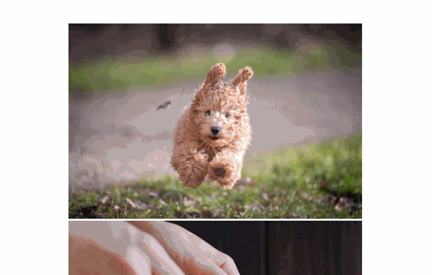

# vue-expandable-image

> Allows your images to open in full size.

# Demo Preview



## Setup

```
npm install vue-expandable-image
```

You have two ways to setup `vue-expandable-image`:

#### CommonJS (Webpack/Browserify)

- ES6

```js
import VueExpandableImage from 'vue-expandable-image'
Vue.use(VueExpandableImage)
```

- ES5

```js
var VueExpandableImage = require('vue-expandable-image')
Vue.use(VueExpandableImage)
```

#### Include

Include it directly with a `<script>` tag. In this case, you don't need to write `Vue.use(VueExpandableImage)`, this will be done automatically for you.

## Demo
You can check this [CodePen](https://codepen.io/tahazsh/pen/aMbooL) to see how it works.

## Usage

Just replace your `` tag with `<expandable-image/>`, and it should work!

## The image doesn't load for you?

If you see your image is broken even though it works on ``, it means you're passing a relative path (like `../assets/image.jpg`) but not loading it through Webpack. [Check out this for more details](https://cli.vuejs.org/guide/html-and-static-assets.html#relative-path-imports).

To fix this issue, you have to load the image explicitly through Webpack before passing it to `src`. And you can do this using `require(imagePath)`.

Example:

``` html
<expandable-image
  :src="require('../assets/image.jpg')"
/>
```

## Props

| Prop                      | Default | Description                                 |
| ------------------------- | ------- | ------------------------------------------- |
| close-on-background-click | `false` | Clicking on the background closes the image |

## License

[MIT](http://opensource.org/licenses/MIT)

Copyright (c) 2019 Taha Shashtari